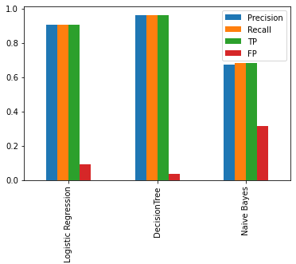

<h1 align="center"> Obesity Level Estimation Based on Decision Trees </h1>

<h4 align="center">Abstract</h4>

In this project <a href="https://thescipub.com/pdf/jcssp.2019.67.77.pdf">Obesity Level Estimation Software based on Decision Trees article published by Eduardo De-La-Hoz-Correa, Fabio E. Mendoza-Palechor, Alexis De-La-Hoz-Manotas, Roberto C. Morales-Ortega and Sánchez Hernández Beatriz Adriana</a> has been tried to replicated. Obesity has become a global epidemic that has doubled since 1980, authors handled that problem authors applied the SEMMA data mining methodology,  to select, explore and model the data set, and then three methods were selected: Decision trees, Bayesian networks (Naïve Bayes) and Logistic Regression, obtaining the best results with Decision trees based on the metrics: Precision, recall, TP Rate and FP Rate. Necessary information and the data itself can be achieved from: <a href="https://archive.ics.uci.edu/ml/datasets/Estimation+of+obesity+levels+based+on+eating+habits+and+physical+condition+">UCI Machine Learning Repository</a>

## Introduction
The World Health Organization (WHO) (OMS, 2016), describes obesity and overweight as excessive fat accumulation in certain body areas that can be harmful to health, the number of people that suffers from obesity has doubled since 1980, and also in 2014 more than 1900 million adults, 18 years old or older, are suffering from alteration of their weight. Obesity is a public health problem worldwide and it can emerge in adults, teens, and children. 

Several authors have studied to analyze the disease and generate web tools to calculate the obesity level of a person, nevertheless, such tools are limited to the calculation of the body mass index, omitting relevant factors such as family background and time dedicated to. Based on this, the authors considered an intelligent tool was needed to be able to detect obesity levels in people more efficiently. In this study, volunteers were surveyed with a series of questions to identify their obesity level, considering several factors such as age, weight, sex, physical activity frequency, fast food intake, and others, that could help to describe the behavior of obese people. The methods and techniques used in the experimentation process of this study, refer to Decision Trees, Naïve Bayes and Logistic Regression. 

## Description of Methods
In this study, the stages based on the SEMMA methodology were performed. First, the dataset creation proceeded, from the information collected by the survey, as described in the below figure. After the dataset creation, the data have been validated, looking for missing values, atypical data, and the correlation level between variables, which is lower than 0.5, so can be sure that the stored data and the basis for the software implementation and the data mining methods are correct. Once the dataset was validated and prepared, the data mining techniques and methods were applied. 

In this study, the methods used were <b>Decision Trees, Bayesian Networks (Naïve Bayes)</b>, and <b>Logistic Regression</b>. To validate the model and selecting the best technique, the Precision metrics Recall, TP Rate, and FP Rate were used. For the training process, cross-validation was used, part of the data for training and other part for testing to guarantee optimal results and avoiding over-training issues. The proposed model considers classes or categories, the values of <i>underweight, normal, overweight, obesity level I, obesity level II</i> and <i>obesity level III</i>.

## Description of Data
The dataset was updated after the publication of this version. Before the updated version there were 712 records. After the update %67 of the data was generated synthetically by the SMOTE filter, and %33 of the data was collected directly from the survey. The dataset contains 17 attributes and 2111 records.

## Expected Results in Paper
Based on the data the technique with the best results was Decision Trees. The technique also obtained better results than the values from techniques such as Bayesian Networks and Logistic Regression.

- The results for <b>Decision Trees</b>: <i>Precision:</i> 97.4%, <i>Recall:</i> 97.8%, <i>TP Rate:</i> 97.8%, <i>FP Rate:</i> 0.2%. 
- The results for <b>Naive Baes</b>: <i>Precision:</i> 90.1%, <i>Recall:</i> 91.1%, <i>TP Rate:</i> 91.1%, <i>FP Rate:</i> 6.0%. 
- The resulst for <b>Logistic Regression</b>: <i>Precision:</i> 90.4%, <i>Recall:</i> 91.6%, <i>TP Rate:</i> 91.6%, <i>FP Rate:</i> 4.1%. 

## Preprocessing Steps
Data set were already preprocessed by the authors as mentioned in [Description of Methods](#description-of-methods) part. But there were still some categorical features and these features were in the character format. After that to improve the article work some feature selection methods have been tried to handled and finally parameter tuning with Grid Search applied.

## Results and Comparison
Due to the dataset used in that article having been changed by applying SMOTE our results may differ from the original article. Also, some criteria haven't been mentioned in the article by authors and we tried to find the best parameter settings and also try to split training and testing data by ourselves.

Our results obtained by using Decision Trees, Logistic Regression and Naive Bayes can be found below figures

Results Table       |  Results Figure
:-------------------------:|:-------------------------:
  |  

When the results compare with the original article there is a huge difference between the Naive Baes scores and Logistic Regression scores. The general scores for the Decision Tree algorithm are almost the same and very close. But these results were obtained by default parameter settings. We'll try to develop these scores in the following sections.

## Feature Selection

### Feature Selection in Numeric Columns
Dataset has only three numeric columns but the feature selection algorithm still applied and tries to find if there is an unnecessary column or not. In this section ANOVA based on selection applied and numeric columns eliminated transform into one by one. But the feature selection algorithm for numeric columns didn't improve the model.

### Feature Selection in Categorical Columns
There are two popular feature selection techniques that can be used for categorical input data and a categorical (class) target variable. They are: <i>Chi-Squared Statistic</i> and <i>Mutual Information Statistic</i>. Pearson’s chi-squared statistical hypothesis test is an example of a test for independence between categorical variables. The results of this test can be used for feature selection, where those features that are independent of the target variable can be removed from the dataset. On the other hand, Mutual information from the field of information theory is the application of information gain (typically used in the construction of decision trees) to feature selection. Mutual information is calculated between two variables and measures the reduction in uncertainty for one variable given a known value of the other variable.

These two popular feature selection techniques have been applied and conclude that the Mutual Information Statistic was more beneficial than the Chi-squared statistic. The categorical columns have been eliminated into three columns and obtained the best results as follows.

Before Feature Selection      |  After Feature Selection
:-------------------------:|:-------------------------:
  |  

As we can see above, there is a significant improvement for the Logistic Regression and Decision Tree but on the other hand that feature selection technique negatively affected the Naive Bayes algorithm.

## Model Hyperparameter Optimization
Machine learning models have hyperparameters. Hyperparameters are points of choice or configuration that allow a machine learning model to be customized for a specific task or dataset. Machine learning models also have parameters, which are the internal coefficients set by training or optimizing the model on a training dataset. Parameters are different from hyperparameters. Parameters are learned automatically; hyperparameters are set manually to help guide the learning process.

With the help of the <b>model_selection</b> library of scikit-learn, we can use the  GridSearchCV to find the best hyperparameters. GridSearchCV, evaluate models for a given hyperparameter vector using cross-validation, hence the “CV” suffix of each class name. GridSearchCV requires two arguments. The first is the model that you are optimizing. This is an instance of the model with values of hyperparameters set that you want to optimize. The second is the search space. This is defined as a dictionary where the names are the hyperparameter arguments to the model and the values are discrete values or distribution of values to sample in the case of a random search.

Subsequently applying GridSearchCV for all learning algorithms we try to come up with the best hyperparameters and plot the results again. 

Before GridSearch       |  After GridSearch
:-------------------------:|:-------------------------:
  |  

## Conclusion
In conclusion, in this article authors try to predict the obesity level of a person. The dataset was almost fully preprocessed and ready for applying to necessary algorithms. After just applying the OneHotEncoding, LabelEncoding, and mapping methods for the ordinal columns data was fully preprocessed. Due to our dataset was not that large the Decision Tree proved its effect once more. In the beginning, my scores are really different from the scores in the article. One reason for that was the update on the dataset. New variables were produced by using SMOTE filter. The other reason was the feature selection and hyperparameter tuning. After dropping the relevant features we obtained better results for Logistic Regression and Decision Tree model. When we applied the GridSearchCV to find the best hyperparameters we obtained much better results than the beginning. The <b>Logistic Regression</b> model has been improved by almost %15. If there would be a clearer explanation of the article I believe that we could achieve much higher accuracy scores and improve the current algorithm better.
